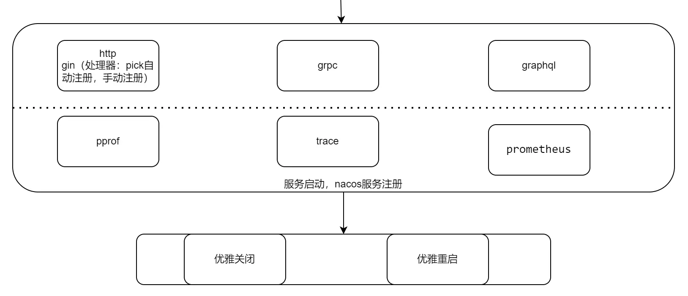

# mix

[](https://pkg.go.dev/github.com/hopeio/mix)
[](LICENSE)

**mix** 是一个开箱即用的 Go 微服务运行时：在同一进程中同时暴露 **HTTP** 与 **gRPC**，并内置可观测性、访问日志与优雅关停。

适合与 [hopeio/protobuf](https://github.com/hopeio/protobuf) 工具链配合，快速搭建基于 Protobuf 的云原生服务。



## 特性

- **同端口多协议** — HTTP/1.1、明文 HTTP/2（gRPC）共用主监听地址；按 `Content-Type` 自动分发到 gRPC 或 HTTP 处理器
- **HTTP/3** — 基于 [quic-go](https://github.com/quic-go/quic-go) 可选启用
- **请求上下文** — 通过 `mix.Metadata` 在 HTTP / gRPC 链路中传递 trace、token、logger 等
- **访问日志** — HTTP 与 gRPC 均可记录请求/响应体，支持路径前缀过滤
- **OpenTelemetry** — HTTP、gRPC 链路追踪与指标，与 [hopeio/gox](https://github.com/hopeio/gox) 日志字段对齐
- **内部端口** — 默认 `:8081` 暴露 OpenAPI 文档（Redoc）与 pprof 调试端点
- **CORS / 中间件 / TLS** — 通过 `Option` 组合配置
- **优雅关停** — 监听 `SIGINT` / `SIGTERM`，依次停止 gRPC 与 HTTP

## 架构

```
                    ┌─────────────────────────────────┐
  Client ──────────►│  :8080  主服务（HTTP + gRPC）    │
                    │  ├─ HTTP  → Gin / ServeMux / …  │
                    │  └─ gRPC  → grpc.Server         │
                    └─────────────────────────────────┘
                    ┌─────────────────────────────────┐
  运维 / 文档 ──────►│  :8081  内部端口                 │
                    │  ├─ /openapi  Redoc 文档        │
                    │  └─ /debug    pprof             │
                    └─────────────────────────────────┘
```

## 快速开始

### 安装

```bash
go get github.com/hopeio/mix
```

### 最小示例

```go
package main

import (
	"net/http"

	"github.com/hopeio/mix"
	"google.golang.org/grpc"
)

func main() {
	mix.NewServer(
		mix.WithHttpHandler(http.HandlerFunc(func(w http.ResponseWriter, r *http.Request) {
			w.Write([]byte("hello"))
		})),
		mix.WithGrpcHandler(func(s *grpc.Server) {
			// pb.RegisterYourServiceServer(s, &impl{})
		}),
	).Run()
}
```

完整示例见 [`_example/`](_example/)：

```bash
go run ./_example
```

`_example` 演示了 gRPC 服务注册，以及通过 [gox/net/http/grpc/gateway](https://github.com/hopeio/gox) 将 RPC 暴露为 HTTP 接口。

## 配置选项

| Option | 说明 |
|--------|------|
| `WithHttpHandler` | 主 HTTP 处理器（必填） |
| `WithGrpcHandler` | 注册 gRPC 服务 |
| `WithHttp` | 自定义 `http.Server` 字段（地址、超时等） |
| `WithHTTP3` | 启用 HTTP/3 |
| `WithInternalServer` | 自定义内部端口（OpenAPI / pprof） |
| `WithCors` | 跨域配置 |
| `WithOtel` | OpenTelemetry |
| `WithMiddleware` | HTTP 中间件链 |
| `WithGrpc` | gRPC 拦截器与 `ServerOption` |

### 请求元数据

在 Handler 中通过 context 获取请求元数据：

```go
import "github.com/hopeio/mix"

func handler(ctx context.Context) {
	md := mix.GetMetadata(ctx)
	if md != nil {
		_ = md.TraceId
		_ = md.Token
		md.Set("key", "value")
	}
}
```

### 与配置注入框架配合

`Server` 实现了 `BeforeInject` / `AfterInject`，可与 [hopeio/initialize](https://github.com/hopeio/initialize) 等 DI 框架集成：

```go
global.Conf.Server.WithOptions(
	mix.WithHttpHandler(app),
	mix.WithGrpcHandler(api.GrpcRegister),
).Run()
```

## 工具链

mix 本身不负责代码生成，推荐配合 hopeio 系列工具使用：

### 安装 protoc 插件

- 安装 [protoc](https://github.com/protocolbuffers/protobuf/releases)
- 安装 hopeio 工具集：

```bash
go run $(go list -m -f {{.Dir}} github.com/hopeio/protobuf)/tools/install_tools.go
```

### 生成代码

```bash
protogen go -d -e -w -v -i _example/proto -o _example/protobuf
```

| 标志 | 含义 |
|------|------|
| `-d` | OpenAPI 文档 |
| `-e` | 枚举扩展 |
| `-w` | Gin gRPC-Gateway |
| `-v` | 请求校验代码 |
| `-g` | GraphQL（可选） |

也可使用 Docker：

```bash
docker run --rm -v $PWD:/work jybl/protogen \
  protogen go -d -e -w -i $proto_path -o $proto_output_path
```

生成物可对接：

- **Gin Gateway** — `protoc-gen-grpc-gin` 生成的路由
- **grpc-gateway** — 标准 `google.api.http` 注解

## 默认端口

| 端口 | 用途 |
|------|------|
| `:8080` | 主服务（HTTP + gRPC） |
| `:8081` | OpenAPI 文档 / pprof |

## 相关项目

| 仓库 | 说明 |
|------|------|
| [hopeio/gox](https://github.com/hopeio/gox) | 日志、HTTP 工具、gRPC-Gateway 封装 |
| [hopeio/protobuf](https://github.com/hopeio/protobuf) | protoc 插件与 `protogen` CLI |
| [hopeio/scaffold](https://github.com/hopeio/scaffold) | OTel、Prometheus、JWT 等脚手架 |
| [hopeio/initialize](https://github.com/hopeio/initialize) | 配置加载与服务初始化 |

## License

[MIT](LICENSE)
