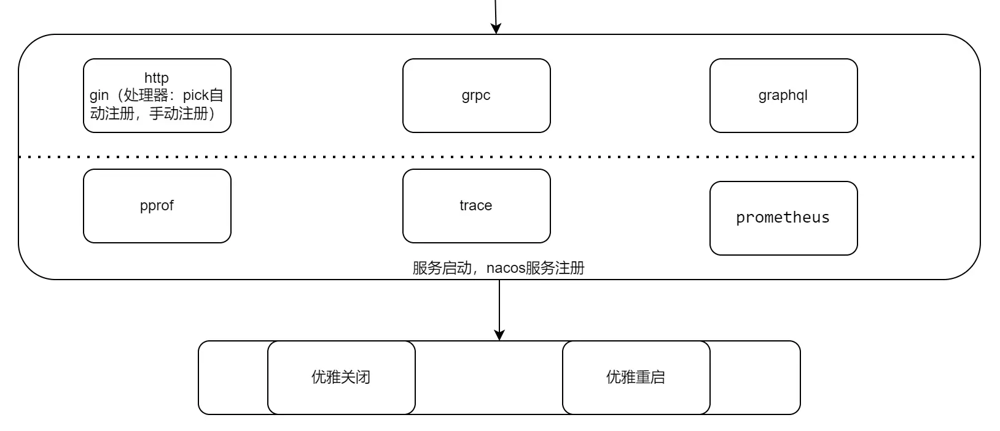

# cherry

一个开箱即用，高度集成的微服务组件库,可以快速开发集grpc,http,graphql的云原生微服务
## quick start
`go get github.com/hopeio/cherry@main`
#### install env tools
- `install protoc`[https://github.com/protocolbuffers/protobuf/releases](https://github.com/protocolbuffers/protobuf/releases)
- `go get github.com/hopeio/cherry/tools/protoc@main`
- `go run $(go list -m -f {{.Dir}}  github.com/hopeio/cherry)/tools/protoc/install_tools.go`
#### generate protobuf
`protogen go -e -w (-q) (-v) -p $proto_path -g $proto_output_path`
#### (use docker)
`docker run --rm -v $project:/work jybl/goprotoc protogen go -e -w -p $proto_path -g $proto_output_path`

##
### initialize
基于反射自动注入的配置及dao注入初始化，并暴露一个全局变量，记录模块信息


#### 一个应用的启动，应该如此简单
##### config（配置）
支持nacos,local file,http请求作为配置中心,可扩展支持etcd,apollo,viper(获取配置代理，底层是其他配置中心)，支持toml格式的配置文件，
支持dev，test，prod环境本，启动命令区分
仅需配置配置中心,后续配置均从配置中心拉取及自动更新
```toml
Module = "hoper"
# dev | test | stage | prod |...
Env = "dev" # 将会选择与Env名字相同的环境配置

[dev] 
debug = true
ConfigTemplateDir = "." # 将会生成配置模板
# 上方是一个个初始配置,如果不知道如何进行接下来的配置,可以先启动生成配置模板
[dev.configCenter]
configType = "local"
Watch  = true
NoInject = ["Apollo","Etcd", "Es"]

[dev.configCenter.local]
Debug = true
ConfigPath = "local.toml"
ReloadType = "fsnotify"

[dev.configCenter.http]
Interval = 10000000000
Url = "http://localhost:6666/local.toml"

[dev.configCenter.nacos]
DataId = "pro"
Group = "DEFAULT_GROUP"

[[dev.configCenter.nacos.ServerConfigs]]
Scheme = "http"
IpAddr = "nacos"
Port = 9000
GrpcPort = 10000

[dev.configCenter.nacos.ClientConfig]
NamespaceId = "xxx"
username = "nacos"
password = "nacos"
LogLevel = "debug"

```
```go
import(
  "github.com/hopeio/cherry/initialize/conf_dao/server"
)
type config struct {
	//自定义的配置
	Customize serverConfig
	Server    server.ServerConfig
}
type serverConfig struct{
    TokenMaxAge time.Duration
}

var Conf = &config{}
// 注入配置前初始化
func (c *config) InitBeforeInject() {
    c.Customize.TokenMaxAge = time.Second * 60 * 60 * 24
}
// 注入配置后初始化
func (c *config) InitAfterInject() {
	c.Customize.TokenMaxAge = time.Second * 60 * 60 * 24 * c.Customize.TokenMaxAge
}

func main() {
    //配置初始化应该在第一位
    defer initialize.Start(Conf, nil)()
}
```
如果还有Dao要初始化
```go
import(
    "github.com/hopeio/cherry/initialize/conf_dao/gormdb/postgres"
    initredis "github.com/hopeio/cherry/initialize/conf_dao/redis"
)
// dao dao.
type dao struct {
	// GORMDB 数据库连接
	GORMDB   *postgres.DB
	StdDB    *sql.DB
	// RedisPool Redis连接池
	Redis *initredis.Client
}
// 注入配置前初始化
func (c *dao) InitBeforeInject() {
}
// 注入配置后初始化
func (c *dao) InitAfterInjectConfig() {
}
// 注入dao后初始化
func (d *dao) InitAfterInject() {
	db := d.GORMDB
	db.Callback().Create().Remove("gorm:save_before_associations")
	db.Callback().Create().Remove("gorm:save_after_associations")
	db.Callback().Update().Remove("gorm:save_before_associations")
	db.Callback().Update().Remove("gorm:save_after_associations")

	d.StdDB, _ = db.DB()
}
func main() {
    defer initialize.Start(Conf, dao)()
}
```
原生集成了redis,gormdb(mysql,postgressql,sqlite),kafka,pebbledb,apollo,badgerdb,etcd,elasticsearch,nsq,ristretto,viper等，并且非常简单的支持自定义扩展,不局限于Dao对象，任何对象都支持根据配置自动注入生成
## context
一个轻量却强大的上下文管理器,一个请求会生成一个context，贯穿整个请求，context记录原始请求上下文，请求时间，客户端信息，权限校验信息，及负责判断是否内部调用，
及附带唯一traceId的日志记录器
其中权限校验采用jwt，具体的校验模型采用接口，可供使用方自定义
支持http及fasthttp,并支持自定义的请求类型


### server
cherry服务器，各种服务接口的保留，集成支持，一个服务暴露grpc,http,graphql接口
- 集成opentelemetry实现调用链路跟踪记录，配合context及utils/log 实现完整的请求链路日志记录
- 集成prometheus及pprof实现性能监控及性能问题排查
- 支持框架自生成的由gin提供支持的grpc转http，也支持原生的grpc-gateway


```go
package main

import (
	"github.com/hopeio/cherry/utils/net/http/gin/handler"
	"net/http"
	"time"

	"github.com/gin-gonic/gin"
	"github.com/hopeio/cherry/server"
	"github.com/hopeio/cherry/initialize"
	"user/protobuf/user"
	uconf "user/confdao"
	udao "user/dao"
	userservice "user/service"
	"github.com/hopeio/cherry/utils/log"
	
	"google.golang.org/grpc"
)

func main() {
	//配置初始化应该在第一位
	defer initialize.Start(uconf.Conf, udao.Dao)()
	
  config := uconf.Conf.Server.Origin()
  config.GrpcOptions = []grpc.ServerOption{
    grpc.StatsHandler(otelgrpc.NewServerHandler()),
  }
  server.Start(&server.Server{
        Config: config,
		GRPCHandler: func(gs *grpc.Server) {
			user.RegisterUserServiceServer(gs, userservice.GetUserService())
		},
		GinHandler: func(app *gin.Engine) {
			_ = user.RegisterUserServiceHandlerServer(app, userservice.GetUserService())
			app.Static("/static", "F:/upload")
		},
        /*	GraphqlHandler: model.NewExecutableSchema(model.Config{
                Resolvers: &model.GQLServer{
                UserService:  service.GetUserService(),
                OauthService: service.GetOauthService(),
            }}),*/
	})
}

```

### protobuf
库中用到的protobuf定义及生成文件


#### 生成库protobuf代码
`go run protobuf/generate.go`

### tools/protoc
本项目需要用到的protobuf插件，`go run tools/protoc/install_tools.go` 或 `go generate tools/protoc/install_tools.go` 或 `tools/protoc/install-tools.sh`，会自动安装

- protogen为go语言写的protobuf生成程序
  - go/dart 生成go/dart文件，E.g: protogen go -p xxx -g xxx
  - -p proto dir
  - -g generate dir
  - (-d) 指定cherry proto dir,如项目引用本项目或使用jybl/protogen image 可省略
  - -e 是否使用enum扩展插件
  - -w 是否使用grpc-gateway插件
  - -v 是否使用validators插件
  - -q 是否使用graphql插件
  - --patch 是否使用原生protopatch
- protoc-go-patch 支持通过ast重新生成自定义结构体tag,生成结构体方法等功能
- protoc-gen-grpc-gin github.com/grpc-ecosystem/grpc-gateway/v2/protoc-gen-grpc-gateway的gin版本，支持生成http路由代理转发到grpc sercvice中
- protoc-gin-enum 分为错误enum及普通enum，生成性能更高支持中文的`String()`,错误enum会额外生成`Error()string`，支持生成枚举的辅助方法,错误enum会额外生成`Error()string`
- 集成github.com/grpc-ecosystem/grpc-gateway/v2/protoc-gen-openapiv2 用于生成swagger文档
- 集成github.com/mwitkow/go-proto-validators/protoc-gen-govalidators 用于生成请求的校验的代码
- 集成github.com/danielvladco/go-proto-gql 用于生成graphql schema 及 grahpql服务


#### template
user.proto
```protobuf
syntax = "proto3";
package user;
import "cherry/protobuf/utils/enum/enum.proto";
import "cherry/protobuf/utils/patch/go.proto";
import "protoc-gen-openapiv2/options/annotations.proto";
import "github.com/mwitkow/go-proto-validators/validator.proto";
import "google/api/annotations.proto";
import "cherry/protobuf/utils/response/response.proto";
import "cherry/protobuf/utils/request/param.proto";
import "danielvladco/protobuf/graphql.proto";
import "cherry/protobuf/utils/oauth/oauth.proto";
import "cherry/protobuf/utils/patch/go.proto";
import "google/protobuf/wrappers.proto";

option java_package = "protobuf.user";
option go_package = "protobuf/user";
option (enum.gqlgen_all) = true;
option (enum.prefix_all) = false;
option (go.file) = {no_enum_prefix:true};
option (grpc.gateway.protoc_gen_openapiv2.options.openapiv2_swagger) = {
  info: {
    version: "1.0"
  }
};
// 用户
message User {
  uint64 id = 1 [(go.field) = {tags:'gorm:"primaryKey;"'}];
  string name = 2 [(go.field) = {tags:'gorm:"size:10;not null" comment:"昵称"'}];
    // 性别，0未填写，1男，2女
  Gender gender = 8 [(go.field) = {tags:'gorm:"type:int2;default:0"'}, (grpc.gateway.protoc_gen_openapiv2.options.openapiv2_field) = {
    type:INTEGER
  }];
}

// 用户性别
enum Gender{
  option (go.enum) = {stringer_name: 'OrigString'};
  GenderPlaceholder = 0 [(enum.enumvalue_cn)= "占位"];
  GenderUnfilled = 1 [(enum.enumvalue_cn)= "未填"];
  GenderMale = 2 [(enum.enumvalue_cn)= "男"];
  GenderFemale = 3 [(enum.enumvalue_cn)= "女"];
}

service UserService {

  option (grpc.gateway.protoc_gen_openapiv2.options.openapiv2_tag) = {
    description: "用户相关接口"
  };
  //获取用户信息
  rpc Info (request.Id) returns (User) {
    option (google.api.http) = {
      get: "/api/v1/user/{id}"
    };
    option (grpc.gateway.protoc_gen_openapiv2.options.openapiv2_operation) = {
      tags:["用户相关接口", "v1.0.0"]
      summary : "获取用户信息"
      description : "根据Id获取用户信息接口"
    };
    option (danielvladco.protobuf.graphql.rpc) = {type: QUERY};
  }

}
```


## 安装执行
- `go get github.com/hopeio/cherry/tools/protoc@main`
- `go run $(go list -m -f {{.Dir}}  github.com/hopeio/cherry)/tools/protoc/install_tools.go`
- `protogen go -p $proto_path -g $proto_output_path`

#### use docker
`docker run --rm -v $project_path:/work jybl/goprotoc protogen go --proto=$proto_path --genpath=$proto_output_path`

### utils

各种工具库

以下是一些可以单独成库的工具
#### scheduler
##### engine
并发控制，一个任务调度框架，可以控制goroutine数量,任务失败重试，任务衍生子任务执行，任务检测，任务统计
##### crawler
爬虫框架，基于conctrl

## contribute
### build docker image
```base
`$cherry_dir/tools/internal/docker/docker_build_local.sh $GOPATH $PROTOC $Image`
```
### upgrade go
`docker build -t jybl/goprotoc -f $cherry_dir/tools/internal/docker/Dockerfile_upgrade .`
## TODO
- unit test
- english document
- License


